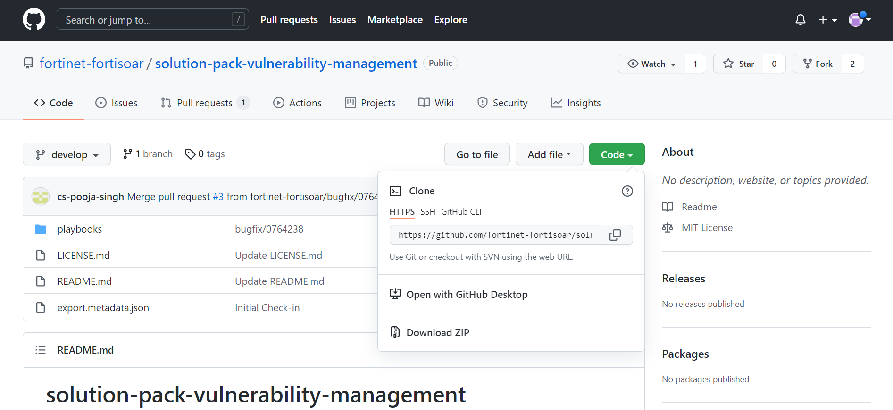

# Vulnerability Management Solution Pack 7.0.2

## Overview

This article describes the FortiSOAR™ Vulnerability Management Solution Pack (solution-pack-vulnerability-management). This solution pack enables users to experience the power and capability of FortiSOAR™ to manage vulnerabilities. 

FortiSOAR™ is built using modular architecture and the FortiSOAR™ Incident Response Solution Pack is the implementation of the best practices to configure and use FortiSOAR™ in an optimal manner. The FortiSOAR™ Incident Response Solution Pack also contains a lot of sample/simulation/training data that enables you to experience FortiSOAR™ without having all the devices.

Vulnerability Management is a collection of all modules typically related to vulnerabilities that exist in your system. It contains the following modules:

- **Assets**: Assets represent a unique piece of hardware and any information known about that hardware, such as MAC address, hostname, or IP address. Assets preferably have a unique identifier. Assets typically are only stored within FortiSOAR™ as records related to Incidents, Alerts, or Vulnerabilities. Asset information may be pulled from a CMDB or other resource available with knowledge of the asset characteristics, such as an ARP table or DHCP records.
- **Scans**: Scans contain the details of all the scans that you run on your systems. It contains records of a bulk scan from scanners.
- **Vulnerabilities**: Vulnerabilities represent a collection of weaknesses in your systems that can lead to security concerns. You can configure vulnerability scans to run periodically on your network, creating an inventory of the vulnerabilities for your specific assets.
- **Users**:  Users represent a list of users who could potentially cause harm to your systems.  

## Deploying Vulnerability Management Solution Pack

**Important**: Before you deploy the solution pack, ensure that you have deployed the FortiSOAR™ Incident Response Solution Pack (solution-pack-incident-response).

Use the following procedure as a *root* user to deploy the solution pack:

1. Log onto the Solution Pack GIT repo (https://github.com/fortinet-fortisoar/solution-pack-vulnerability-management](https://github.com/fortinet-fortisoar/solution-pack-vulnerability-management)) using your credentials.
2. Click the **Code** button and select the **Download ZIP** option.
   
3. Log into your FortiSOAR instance, and on the left-navigation, click **Import Wizard**.
   
4. On the `Import Wizard` page, click **Import From File** and selected the solution pack zip that you have downloaded, and navigate through the Import Wizard.
   
   **Note**: It is recommended not the change any configurations or options of the imported solution pack zip file.
   Once the import is successfully completed, you can use the SOC Simulator IR solution pack.
